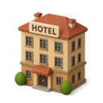

<div align="center">
  

  # 🏨 Your Real Hotel Stay

  **See hotels as they really are — full of life!**
  
  [](https://developer.chrome.com/docs/extensions/mv3/intro/)
  [](https://ai.google.dev/)
  [](https://opensource.org/licenses/MIT)

  <p align="center">
    "Your Real Hotel Stay" uses advanced Google AI to realistically add people to empty hotel marketing images.<br>
    <b>No more ghost towns. See the vibe before you book.</b>
  </p>

  [🎥 Watch the Installation Tutorial](https://www.youtube.com/watch?v=NH5CPm9pyts) <br/> <br/>
  [🎥 Watch the Demo](https://x.com/MoneOunchPan/status/1998125056837226969?s=20)
</div>

---

## ✨ Features

- 🤖 **AI-Powered Magic**: Uses Google's **Gemini 2.5 Flash** & **Gemini 3 Pro** models to seamlessly inpaint people into scenes.
- 🎨 **Customizable Vibe**: Tell the AI what you want — "happy families", "digital nomads", or "party crowd".
- ⚡ **Instant Preview**: Hover over any image on a booking site and click **"Add People (AI)"**.
- 🧠 **Smart Model Selection**: Choose between speed ("Nano Banana") or quality ("Nano Banana Pro").

---

## 🌐 Supported Browsers

Built with **Manifest V3**, this extension runs natively on all Chromium-based browsers:

| Browser | Status |
| :--- | :---: |
|  **Google Chrome** | ✅ |
|  **Microsoft Edge** | ✅ |
|  **Brave** | ✅ |
|  **Opera** | ✅ |
|  **Vivaldi** | ✅ |
| **Arc Browser** | ✅ |

---

## 🚀 Installation

### Option 1: The Easy Way (Download ZIP) 📦

1.  **📥 Download**: [Click here to download the extension ZIP file](./zip/your-real-hotel-stay-v1.0.0.zip).
2.  **📂 Unzip**: Extract the downloaded file to a folder on your computer.
3.  **🔧 Open Extensions**:
    *   **Chrome**: Go to `chrome://extensions/`
    *   **Edge**: Go to `edge://extensions`
    *   **Brave**: Go to `brave://extensions`
    *   **Opera**: Go to `opera://extensions`
    *   **Vivaldi**: Go to `vivaldi://extensions`
    *   **Arc**: Go to `arc://extensions`
4.  **🔛 Developer Mode**: Toggle the **"Developer mode"** switch (usually in the top right).
5.  **📂 Load Unpacked**: Click the **"Load unpacked"** button and select the folder you extracted.
6.  **🎉 Done!** Pin the extension to your toolbar and start using it.

### Option 2: For Developers (Git) 💻

```bash
git clone https://github.com/yourusername/your-real-hotel-stay.git
cd your-real-hotel-stay
# Follow steps 3-5 above, selecting this folder
```

---

## 🎮 Usage

1.  **🔑 Setup**: Click the extension icon and enter your [Google AI Studio API Key](https://aistudio.google.com/app/apikey).
2.  **⚙️ Configure**: Select your preferred model (Nano Banana is faster!).
3.  **🏨 Browse**: Go to Booking.com, Expedia, or any hotel site.
4.  **✨ Magic**: Hover over a hotel image and click the **"Add People (AI)"**.

---

## ⚠️ Disclaimer

> This extension is a fun project and is not affiliated with any hotel booking platform or Google. 
> AI-generated images are for visualization purposes only and may vary in quality and accuracy.

<div align="center">
  <br>
  <p>Made with ❤️ by <a href="https://x.com/MoneOunchPan">@MoneOunchPan</a></p>
  <a href="https://buy.stripe.com/8x23cw1xvfVr3oEbKvawo01">
    
  </a>
</div>
